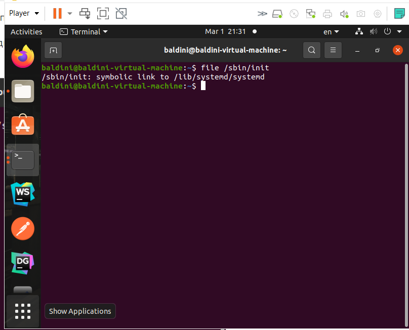

# Lab 2 Балдин И.А. мк-401
1. Каков размер MBR из чего он состоит?
 512 байт. Состоит из кода загрузчика, таблица разделов и сигнатуры.

2. Сколько разделов поддерживает MBR
3.  До 4 разделов

3. Описать процесс загрузки все этапы на bios и uefi.
  - BIOS:
    - После подачи питания BIOS производит POST (Power-on self test) - проверку аппаратного обеспечения.
    - Затем считывает MBR по абсолютному адресу (0x7C00) в оперативную память и передает ему управление.
    - MBR определяет активный системный раздел диска и передает управление на его загрузочный сектор.
    - Затем управление передается в PBS (Partition Boot Sector) соответствующего раздела диска.
    - Запускается менеджер загрузки ОС (GRUB или др.).
    - Загружается ядро ОС и управление передается на него.
  - UEFI:
    1) Фаза SEC (Security).
      - Очищается кэш CPU
      - Запускается процедура главной инициализации в ROM
      - Процессор переходит в защищенный режим работы
      - Передача данных и управления в фазу PEI.
    2) Фаза PEI (Pre-EFI Initialization).
      - Данные из ROM переносятся в кэш
      - Инициализируется CRTM (Core Root for Trust of Measurement) - набор инструкций, который запускается платформой в ходе выполнения RTM операций
      - Загружается диспетчер PEI, который подгружает серию модулей (PEIM), завершающих оставшие задачи PEI.
      - PEIM: Загружаются и запускаются модули инициализации процессоров (модуль кеша процессора, модуль выбора частоты процессора).
      - PEIM: Инициализируются встроенные интерфейсы платформы (SMBus), MCH (Memory Controller Hub), ICH (I/O Controller Hub).
      - PEIM: Инициализируется основная память и в нее переносятся данные из кеша.
      - Проверка режима S3. Если он выключен, то передается управление в фазу DXE. Иначе происходит восстановление исходного состояния процессора и всех устройств и переход к ОС.
    3) Фаза DXE (Driver eXecution Environment).
      - Загружается ядро DXE, создаются необходимые структуры данных. Запускаются Boot Services, Runtime Services, DXE Services.
      - Запуск диспетчера DXE. Определяются драйвера и приложения со всех доступных носителей, которые запускаются, соблюдая зависимости.
      - Запускается UEFI Boot Manager.
    3) Фаза BDS (Boot Device Selection).
      - Инициализируются консольные устройства.
      - Загружаются UEFI-драйвера устройств
      - Загружается UEFI-приложение с устройства загрузки.
      
 4. описать порядок загрузки ОС на sysVinit и systemd
  1) sysVinit
    - Используя инструкции из /etc/inittab запускает несколько процессов. Первый - /etc/init.d/rcS - выполняет все программы из /etc/rcS.d/ (настройка клавиатуры в консоли, загрузка драйверов, настройка сети и т.д.)
    - Затем запускается /etc/init.d/rc 2, которые запускает сервисы из /etc/rc2.d. Названия файлов начинаются с буквы "S" и 2 цифр, определяющих очерёдность запуска.
    - Сервисы, начинающиеся с S запускаются, с K - выключаются.
    - По умолчанию, поддерживается 4 уровня запуска: 0 - при включении питания, 1 - однопользовательский режим (основные сервисы и операции по обслуживанию), 2 - уровень нормальной работы (сетевые сервисы, графический интерфейс, авторизация пользователей), 6 - остановка системы.
  2) systemd
    - Первым исполняется default.target (символическая ссылка на основной таргет, например, на graphical.target или multi-user.target). Дальше составляется дерево зависимостей юнитов:
      - если в юнит-файле unit1 используется директива Wants, то юниты, указанные в директиве будут запущены вместе с unit1 (при этом результат запуска этих юнитов не важен).
      - если в юнит-файле unit1 используется директива Requires=unit2, то будут запущены оба юнита, но если unit2 не будет успешно запущен, то unit1 будет деактивирован автоматически.
    - Также можно использовать директивы Before и After, для задания точного порядка запуска юнитов:
      - Если unit1 содержит Before=unit2 при одновременной загрузке обоих юнитов, то unit1 будет запущен до момента запуска unit2
      - Если unit1 содержит After=unit2, то при запуске обоих юнитов unit2 будет полностью завершен перед запуском unit1

5. показать скриншоты вашего используемого Linux дистрибутива и объяснить на какой системе инициализации он работает
- 
- Дистрибутив работает на системе инициализации systemd
